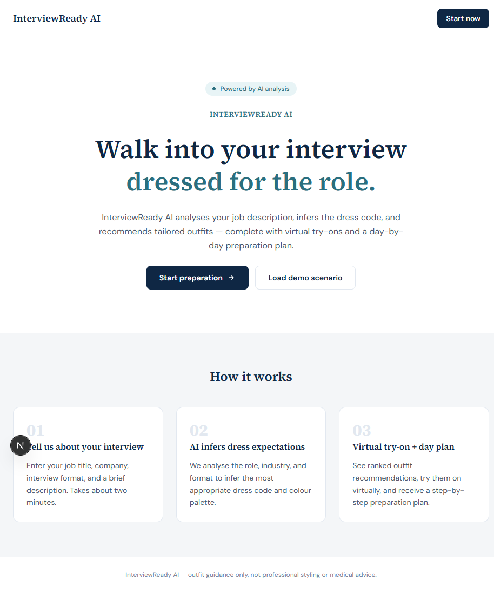
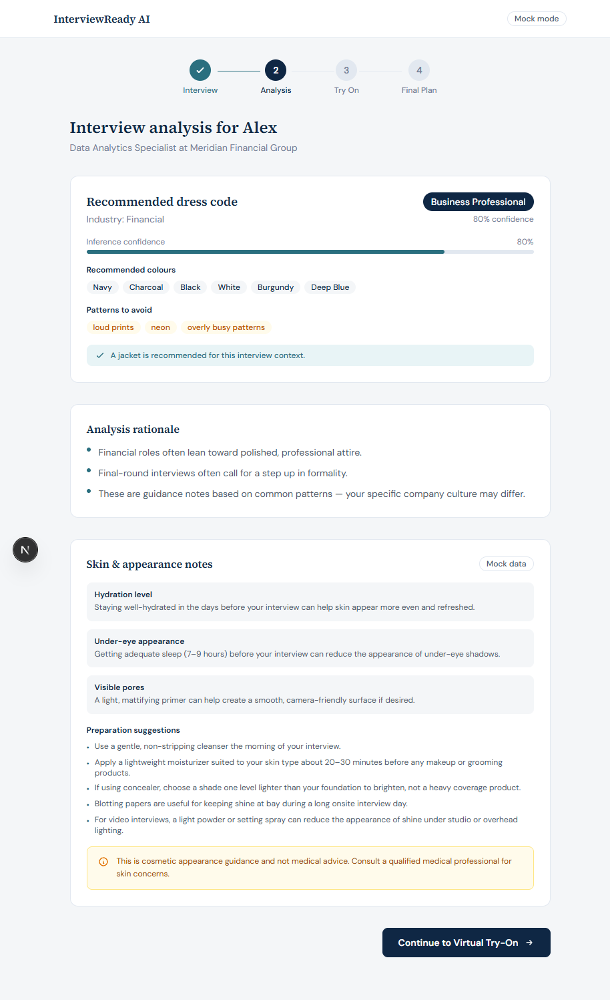
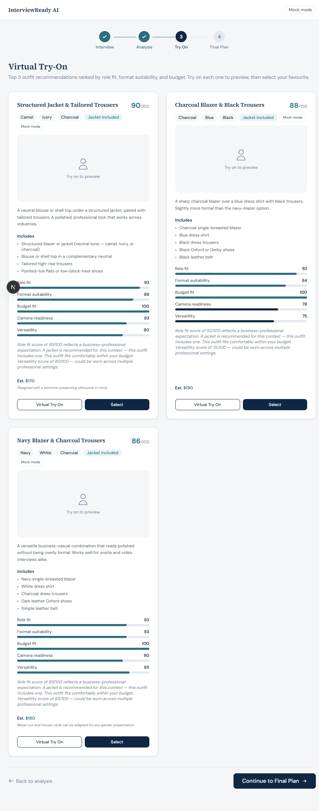
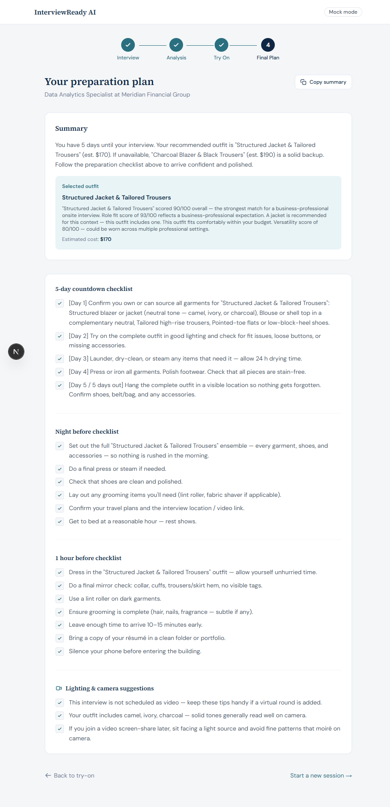

# FitCheck AI

**Know what to wear, using what you own.**

FitCheck AI checks a complete outfit against a real event. The user describes
what they are attending in one sentence, the app infers a broad dress context, and
its wardrobe composer recommends coherent looks from pieces already owned. The
interview flow remains available as a focused mode, while shopping and garment
purchasing are intentionally deferred to a later phase.

---

## Hackathon Context

Built for the **[YouCam API Skin AI & Apparel VTO Hackathon](https://youcam.com)**.  
This project demonstrates how YouCam's cosmetic and fashion AI APIs can support a practical, wardrobe-first outfit check: FitCheck AI gathers event context and composes from the closet, while YouCam adds optional Skin AI guidance and visual try-on when valid image inputs are available.

---

## Screenshots

| Landing page | Analysis | Virtual Try-On | Preparation Plan |
|---|---|---|---|
|  |  |  |  |

---

## Architecture Overview

```
Describe the event in one sentence
       │
       ▼
Next.js App Router  ─────────────────────────────────────────┐
  /api/occasions (POST)                                       │
       │                                                      │
       ├─► Event Inference + Detail Assessment               │
       │     ├── Plain-language event classification        │
       │     ├── Ask for restaurant / venue / company when │
       │     │   the request is sparse                     │
       │     └── Optional color + manual skin-tone palette │
       │                                                      │
       ├─► Event Context Provider                            │
       │     ├── Curated mock context today                 │
       │     └── Bounded web research adapter later         │
       │                                                      │
       ├─► Wardrobe Composer                                 │
       │     ├── Existing pieces + worn-style history        │
       │     ├── Formality / palette compatibility            │
       │     └── Complete looks + wardrobe gaps               │
       │                                                      │
       ├─► YouCam Provider (mock or live)                     │
       │     ├── Skin AI  → cosmetic prep notes               │
       │     └── AI Clothes VTO → visual garment preview      │
       │                                                      │
       ├─► Safety layer                                       │
       │     └── Strips medical/hiring language from output   │
       │                                                      │
       └─► File-based stores (.data/*)                        │
             └── Prisma schema/migrations exist; runtime use is deferred ─┘
```

See [`docs/architecture.md`](docs/architecture.md) for the full Mermaid diagram.

---

## Tech Stack

| Layer | Technology |
|---|---|
| Framework | Next.js 16 (App Router) |
| Language | TypeScript 5 |
| Styling | Tailwind CSS 4 |
| Validation | Zod 4 |
| ORM schema | Prisma 7 (SQLite) |
| Session store (MVP) | File-based `.data/sessions.json` |
| Unit tests | Vitest 4 |
| E2E tests | Playwright |
| AI / APIs | YouCam Skin AI + Apparel VTO |

---

## Setup Instructions

### Prerequisites

- Node.js 20+
- npm 10+

### Install dependencies

```bash
npm install
```

This runs `prisma generate` automatically via the `postinstall` script.

### Environment variables

Copy the example file and fill in values:

```bash
cp .env.example .env.local
```

| Variable | Required | Description |
|---|---|---|
| `VENUE_MODE` | No | Set to `openai` to enable optional OpenAI web research for concrete venue/location anchors; omit for deterministic mock context |
| `OPENAI_API_KEY` | OpenAI research only | Server-side OpenAI API key; never expose it to the browser |
| `OPENAI_WEB_SEARCH_MODEL` | No | OpenAI model used with the Responses web-search tool; defaults to `gpt-4o-mini` |
| `YOUCAM_MODE` | No | Set to `live` to enable live YouCam calls; omit (or use any other value) for mock mode |
| `YOUCAM_API_KEY` | Live only | Your YouCam API key |
| `YOUCAM_BASE_URL` | No | Live API base URL; defaults to the official Perfect Corp host when omitted |
| `DATABASE_URL` | No | SQLite path (e.g. `file:./dev.db`); unused in MVP file-store mode |

---

## Mock Mode (default and verified demo path)

By default the app runs in **mock mode** — no YouCam API keys are required. This is the verified submission/demo path.

```bash
npm run dev
```

Skin AI, AI Clothes VTO, and event context lookup use deterministic mock data by default. If `VENUE_MODE=openai` is configured, concrete venue/location anchors can use a bounded OpenAI web-search request and store only structured style context plus up to three source URLs. Sparse event prompts reveal follow-up questions for location, dress code, and optional color guidance. The mock badge appears in the top-right of each page. Image upload is implemented for the optional interview selfie and wardrobe pieces; uploads are downscaled before use.

Start at [`http://localhost:3000`](http://localhost:3000). Use **Start with an occasion** to jump to the open-ended event prompt, then submit a natural-language request. If you want to see a deterministic example, click **See an event example** to open the rooftop dinner event flow.

---

## Live YouCam Integration

> **Status:** `LiveYouCamProvider` is implemented with authenticated upload/task polling. A credentialed local smoke test verified the full live Skin AI path; mock mode remains the reliable/default demo path.

1. Obtain credentials from the YouCam developer portal.
2. Set environment variables in `.env.local`:
   ```
   YOUCAM_MODE=live
   YOUCAM_API_KEY=your_key_here
   # Optional; defaults to https://yce-api-01.makeupar.com
   YOUCAM_BASE_URL=https://yce-api-01.makeupar.com
   ```
3. Provide a valid candidate image for Skin AI. Live Apparel VTO also requires a candidate image **and a garment reference image**; the current built-in outfit templates and try-on route do not ingest garment assets.

The live provider uses the current Perfect Corp task endpoints and maps responses into the app's domain types. See [`docs/youcam-integration.md`](docs/youcam-integration.md) for requirements and current verification status.

---

## Safety Constraints

- **No medical advice.** All skin output is cosmetic only. A disclaimer is always appended.
- **No hiring predictions.** Language about attractiveness, hirability, or employer preferences is stripped automatically by the safety layer.
- **No demographic inference.** Terms like race, ethnicity, Fitzpatrick scale, and melanin are blocked from appearing in user-facing output.
- **Image handling.** Interview and wardrobe uploads are processed in the app and stored by the MVP's file-based stores as needed for the demo; no external image storage is configured.

See [`docs/privacy-and-safety.md`](docs/privacy-and-safety.md) for the full policy.

---

## Known Limitations

- **Mock mode is the reliable/default demo path.** Live Skin AI has been credentialed-tested locally; live Apparel VTO is intentionally not enabled in the default wardrobe flow.
- **Live Apparel VTO needs garment reference images.** The current built-in outfit templates and try-on route do not ingest or submit those assets; a future shopping/garment flow will add that input.
- **Event context research is optional.** Set `VENUE_MODE=openai` with a server-side `OPENAI_API_KEY` to research concrete venue/location anchors through the Responses web-search tool; the default mock provider remains the reliable demo path. The app stores structured context and source URLs rather than raw web pages.
- **YouCam is downstream of styling.** FitCheck composes outfits from wardrobe items; YouCam can analyze or render valid user/garment images, but it does not discover a wardrobe or select a multi-piece outfit.
- **Video capture is deferred.** Video interview guidance exists, but the app does not capture or upload video.
- **Prisma persistence is deferred.** The MVP uses `.data/sessions.json` and related file stores; Prisma schema/migrations are retained for a later adapter-backed migration.
- **Outfit templates are static.** The six templates are hand-curated; wardrobe composition becomes more useful as users add pieces and worn history.

---

## Demo Flows

### Event demo from the landing page

1. Open [`http://localhost:3000`](http://localhost:3000)
2. Click **See an event example** (or navigate to `/occasion/demo`)
3. Review the rooftop dinner event context and inferred dress code
4. Add wardrobe pieces from **My wardrobe** to receive complete combinations

### Legacy YouCam walkthrough

The original interview-focused YouCam walkthrough remains available directly at
`/demo` for hackathon testing:

1. Navigate to `/demo`
2. The app pre-fills the Alex / Data Analytics / Meridian Financial Group scenario and runs analysis
3. **Analysis page** — see inferred dress code (Business Professional), recommended colours, and cosmetic prep notes
4. **Virtual Try-On page** — browse three ranked outfits and click **Try on** to generate a VTO preview
5. **Select** your preferred outfit and click **Continue to Final Plan**
6. **Plan page** — review the 5-day countdown checklist, night-before checklist, and 1-hour-before checklist

For the full scripted walkthrough see [`docs/demo-script.md`](docs/demo-script.md).

---

## Running Tests

```bash
# Unit tests (Vitest)
npm test

# Unit tests in watch mode
npm run test:watch

# E2E tests (Playwright) — starts or reuses the dev server automatically
npm run test:e2e

# Type-check without emitting
npm run typecheck
```

---

## Database / ORM Commands

```bash
npm run db:generate   # prisma generate
npm run db:migrate    # prisma migrate dev
```

---

## License

MIT
