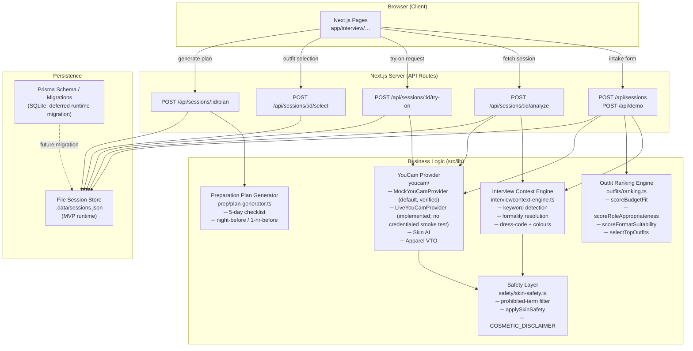

# Architecture

## Overview

InterviewReady AI is a Next.js 16 (App Router) application. The server handles session creation and analysis; the client renders results and drives the try-on / plan flow.

---

## System Diagram



---

## Request / Response Flow

### 1. Intake → Analysis

```
POST /api/sessions
  body: IntakePayload (validated by IntakeSchema / Zod)
        │
        ├─► inferInterviewContext()
        │     ├── detect formality from industry keywords
        │     ├── adjust for interviewFormat (video / onsite / executive / …)
        │     ├── adjust for interviewStage (final bumps formality)
        │     └── returns InterviewContext { dressCode, recommendedColors, avoidPatterns, … }
        │
        ├─► selectTopOutfits()
        │     ├── score each OutfitTemplate against context + budget + format
        │     └── return top 3 RankedOutfit[]
        │
        └─► YouCam Skin AI (mock or live)
              ├── analyzeSkin(imageBase64)
              ├── safety filter → applySkinSafety()
              └── attach to session
```

### 2. Virtual Try-On

```
POST /api/sessions/:id/try-on   { outfitId }
        │
        └─► YouCam Apparel VTO
              ├── generateApparelTryOn({ userImageBase64, garmentAssetId })
              └── returns ApparelTryOnResult { renderedImageUrl, isMock }
```

### 3. Preparation Plan

```
POST /api/sessions/:id/plan
        │
        └─► generatePreparationPlan({ selected, alternative, context, interviewFormat, interviewDate })
              └── returns PreparationPlan {
                    fiveDayChecklist, nightBeforeChecklist,
                    oneHourBeforeChecklist, lightingAndCameraSuggestions,
                    summaryText, whySelected, estimatedTotalPrice
                  }
```

---

## Prisma Models

The `prisma/schema.prisma` defines the following SQLite models and migration path; Prisma is not used for MVP runtime persistence:

| Model | Purpose |
|---|---|
| `InterviewSession` | Root session record — links all other models |
| `UploadedImage` | Optional candidate photo |
| `InterviewContextRecord` | Persisted inference result |
| `SkinAnalysis` | Raw + filtered Skin AI output |
| `Outfit` | Ranked outfit snapshot per session |
| `OutfitEvaluation` | Per-dimension scores for an outfit |
| `VirtualTryOnResult` | VTO rendered image URL |
| `PreparationPlan` | Generated checklist + summary |

### MVP persistence note

Prisma 7 requires a **driver adapter** for SQLite (e.g. `@prisma/adapter-better-sqlite3`). The schema and migration remain available, but Prisma persistence is deferred for the MVP: the app uses lightweight file stores such as `src/lib/session-store.ts` and `.data/sessions.json`.

---

## YouCam Provider Abstraction

```
YouCamProvider (interface)
  ├── MockYouCamProvider   ← default and verified; deterministic, no credentials
  └── LiveYouCamProvider   ← implemented upload/task-polling client; not credential-smoke-tested
```

The active provider is selected at runtime:

```ts
// src/lib/youcam/client.ts
const provider =
  process.env.YOUCAM_MODE === "live"
    ? new LiveYouCamProvider(config)
    : new MockYouCamProvider();
```

The live provider currently implements Skin AI and Apparel VTO transport, including file upload, task creation, polling, response mapping, and URL validation. Live Skin AI still needs a credentialed smoke test. Live Apparel VTO additionally requires both a user image and a garment reference image; the current built-in outfit flow does not ingest those garment assets.

The venue provider follows the same pattern, but only the mock venue lookup is currently available. Video capture is not implemented, and Prisma persistence remains deferred in favor of the file stores.

---

## Safety Layer

Every piece of text that originates from a YouCam API response passes through `applySkinSafety()` before being stored or rendered:

1. `sanitizeSkinAnalysisText(text)` — checks for ~30 prohibited terms (diagnostic, attractiveness, hiring, demographic)
2. Observations / suggestions containing prohibited terms are **silently dropped** (not redacted)
3. `COSMETIC_DISCLAIMER` is **always** appended to the disclaimer field

---

## Directory Structure

```
src/
  app/              ← Next.js App Router pages + API routes
  components/       ← UI components (shadcn-style)
  lib/
    interview/      ← context-engine, demo-scenario
    outfits/        ← templates, ranking
    prep/           ← plan-generator
    safety/         ← skin-safety
    services/       ← session-service (orchestrator)
    validation/     ← Zod schemas
    youcam/         ← provider interface + mock + implemented live client
  types/            ← shared TypeScript domain types
prisma/             ← schema.prisma + migrations
docs/               ← this documentation
```
