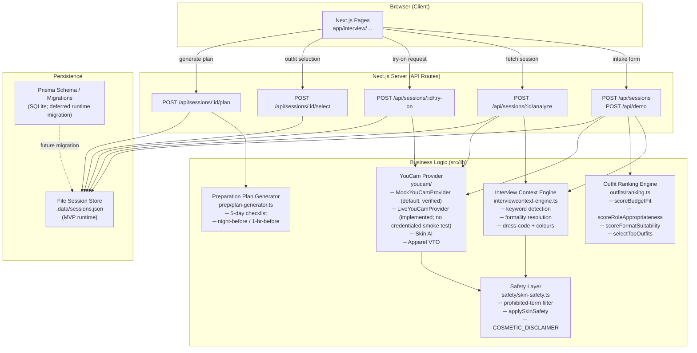

# Architecture

## Overview

FitCheck AI is a Next.js 16 (App Router) application. The server handles
event checks, optional event-context research, wardrobe composition, and legacy
interview sessions; the client renders results and drives the try-on / plan flow.

## Event-first request flow

The primary flow is intentionally staged so the first screen stays simple:

1. **Choose the current source:** compose from the user's saved wardrobe. A
   future source will find pieces that best suit the user.
2. **Name the event:** accept a natural-language event request and infer a
   bounded event type/dress context.
3. **Clarify only when needed:** sparse requests ask for the restaurant,
   venue, company, city, dress code, vibe, and optional manual color or
   skin-tone preferences.
4. **Research event context when useful:** the default venue provider is deterministic mock data. With `VENUE_MODE=openai` and a server-side `OPENAI_API_KEY`, concrete venue/location anchors use the Responses web-search tool and return structured dress context plus up to three source URLs.
5. **Compose wardrobe outfits:** rank combinations from owned pieces using event
   formality, researched palette, worn history, and explicit preferences.
6. **Visualize optionally:** send valid image/reference inputs to the relevant
   YouCam capability. Event text and web research guide FitCheck&apos;s decision;
   they are not a substitute for YouCam&apos;s required media inputs.

Web results are untrusted content. The live adapter must limit domains/query
scope, sanitize retrieved text, preserve citations, and keep raw page content
out of provider requests unless an explicit, reviewed classifier requires it.

---

## System Diagram



---

## Request / Response Flow

### 1. Intake → Analysis

```
POST /api/sessions
  body: IntakePayload (validated by IntakeSchema / Zod)
        │
        ├─► inferInterviewContext()
        │     ├── detect formality from industry keywords
        │     ├── adjust for interviewFormat (video / onsite / executive / …)
        │     ├── adjust for interviewStage (final bumps formality)
        │     └── returns InterviewContext { dressCode, recommendedColors, avoidPatterns, … }
        │
        ├─► selectTopOutfits()
        │     ├── score each OutfitTemplate against context + wardrobe history
        │     └── return top 3 RankedOutfit[]
        │
        └─► YouCam Skin AI (mock or live)
              ├── analyzeSkin(imageBase64)
              ├── safety filter → applySkinSafety()
              └── attach to session
```

### 2. Virtual Try-On

```
POST /api/sessions/:id/try-on   { outfitId }
        │
        └─► YouCam Apparel VTO
              ├── generateApparelTryOn({ userImageBase64, garmentAssetId })
              └── returns ApparelTryOnResult { renderedImageUrl, isMock }
```

### 3. Preparation Plan

```
POST /api/sessions/:id/plan
        │
        └─► generatePreparationPlan({ selected, alternative, context, interviewFormat, interviewDate })
              └── returns PreparationPlan {
                    fiveDayChecklist, nightBeforeChecklist,
                    oneHourBeforeChecklist, lightingAndCameraSuggestions,
                    summaryText, whySelected, estimatedTotalPrice
                  }
```

---

## Prisma Models

The `prisma/schema.prisma` defines the following SQLite models and migration path; Prisma is not used for MVP runtime persistence:

| Model | Purpose |
|---|---|
| `InterviewSession` | Root session record — links all other models |
| `UploadedImage` | Optional candidate photo |
| `InterviewContextRecord` | Persisted inference result |
| `SkinAnalysis` | Raw + filtered Skin AI output |
| `Outfit` | Ranked outfit snapshot per session |
| `OutfitEvaluation` | Per-dimension scores for an outfit |
| `VirtualTryOnResult` | VTO rendered image URL |
| `PreparationPlan` | Generated checklist + summary |

### MVP persistence note

Prisma 7 requires a **driver adapter** for SQLite (e.g. `@prisma/adapter-better-sqlite3`). The schema and migration remain available, but Prisma persistence is deferred for the MVP: the app uses lightweight file stores such as `src/lib/session-store.ts` and `.data/sessions.json`.

---

## YouCam Provider Abstraction

```
YouCamProvider (interface)
  ├── MockYouCamProvider   ← default and verified; deterministic, no credentials
  └── LiveYouCamProvider   ← implemented upload/task-polling client; not credential-smoke-tested
```

The active provider is selected at runtime:

```ts
// src/lib/youcam/client.ts
const provider =
  process.env.YOUCAM_MODE === "live"
    ? new LiveYouCamProvider(config)
    : new MockYouCamProvider();
```

The live provider currently implements Skin AI and Apparel VTO transport, including file upload, task creation, polling, response mapping, and URL validation. Live Skin AI still needs a credentialed smoke test. Live Apparel VTO additionally requires both a user image and a garment reference image; the current built-in outfit flow does not ingest those garment assets.

The venue/research provider follows the same pattern. `MockVenueLookupProvider`
is deterministic and now accepts an optional location anchor; the live provider
is the seam for a future web-search adapter and is not yet an unrestricted
scraper. Video capture is not implemented, and Prisma persistence remains
deferred in favor of the file stores.

---

## Safety Layer

Every piece of text that originates from a YouCam API response passes through `applySkinSafety()` before being stored or rendered:

1. `sanitizeSkinAnalysisText(text)` — checks for ~30 prohibited terms (diagnostic, attractiveness, hiring, demographic)
2. Observations / suggestions containing prohibited terms are **silently dropped** (not redacted)
3. `COSMETIC_DISCLAIMER` is **always** appended to the disclaimer field

---

## Directory Structure

```
src/
  app/              ← Next.js App Router pages + API routes
  components/       ← UI components (shadcn-style)
  lib/
    interview/      ← context-engine, demo-scenario
    outfits/        ← templates, ranking
    prep/           ← plan-generator
    safety/         ← skin-safety
    services/       ← session-service (orchestrator)
    validation/     ← Zod schemas
    youcam/         ← provider interface + mock + implemented live client
  types/            ← shared TypeScript domain types
prisma/             ← schema.prisma + migrations
docs/               ← this documentation
```
